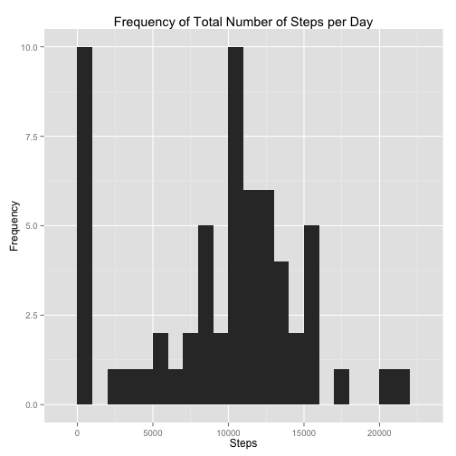
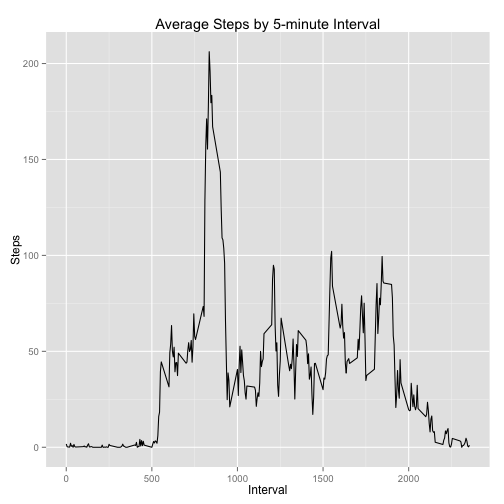
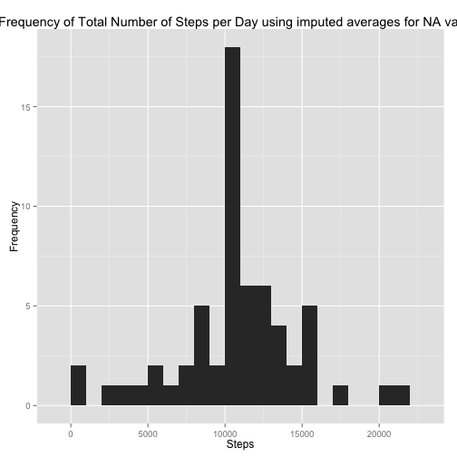
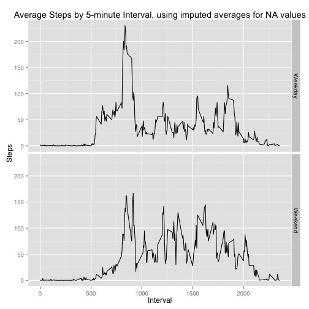

## Loading and preprocessing the data

```r
library(data.table) # Use the data.table package for speed
library(ggplot2) # Use ggplot2 for pretty graphs
library(tidyr)

# Save/Load processed file as a .RData file for speed
if (!file.exists('activity.RData'))
{
  # If the .RData file doesn't exist, create it.
  # Unzip and load data from zip file
  if (!file.exists('activity.csv'))
    unzip(zipfile='activity.zip', 
          files=c('activity.csv'))
  
  # This first line will likely take a few seconds. Be patient!
  activity <- fread('activity.csv')
  activity$date <- as.Date(activity$date, format='%Y-%m-%d')
  
  # Save data so you don't have to do the formatting again.
  save(activity, file='activity.RData')
} else # Saved data already exists, load from RData file
  load('activity.RData')
```

## What is mean total number of steps taken per day?

```r
# Summarize activity into steps per day
stepsPerDay <- activity[,list(steps=sum(steps,na.rm=TRUE)),by=date]
setkey(stepsPerDay, date)
g <- ggplot(stepsPerDay, aes(x=steps))
g <- g + geom_histogram(binwidth=1000)
g <- g + labs(title='Frequency of Total Number of Steps per Day', x='Steps', y='Frequency')
g
```

 

Mean: 9354.2295082 steps per day

Median: 10395 steps per day

## What is the average daily activity pattern?

```r
# Summarize activity into steps per interval
stepsPerInterval <- activity[,list(steps=mean(steps,na.rm=TRUE)),
                             by=list(interval)]
g <- ggplot(stepsPerInterval, aes(x=interval, y=steps))
g <- g + geom_line()
g <- g + labs(title='Average Steps by 5-minute Interval', x='Interval', y='Steps')
g
```

 

Interval with maximum number of steps: 835 (206.1698113 steps)

## Imputing missing values
Number of missing values in the dataset: 2304


```r
# Impute missing steps by interval using the average number of steps for each interval
activityImp <- activity
for (interval in stepsPerInterval$interval)
{
  # For each interval, replace steps entries of NA with the average number of steps
  # for that interval.
  activityImp$steps[(is.na(activityImp$steps) & activityImp$interval == interval)] <- 
    stepsPerInterval$steps[stepsPerInterval$interval == interval]
}

# Summarize activity with imputed data into steps per day
stepsPerDayImp <- activityImp[,list(steps=sum(steps)),by=date]
setkey(stepsPerDayImp, date)
g <- ggplot(stepsPerDayImp, aes(x=steps))
g <- g + geom_histogram(binwidth=1000)
g <- g + labs(title='Frequency of Total Number of Steps per Day using imputed averages for NA values', x='Steps', y='Frequency')
g
```

 

Imputed Mean: 1.0766189 &times; 10<sup>4</sup> steps per day ( 1411.959171 more steps than non-imputed)

Imputed Median: 1.0766189 &times; 10<sup>4</sup> steps per day ( 371.1886792 more steps than non-imputed)

## Are there differences in activity patterns between weekdays and weekends?

```r
# Determine which days are weekdays and which are weekends
activityImp$day <- weekdays(activityImp$date)
activityImp$weekday <- 'Weekday'
activityImp$weekday[activityImp$day %in% c('Saturday','Sunday')] <- 'Weekend'

# Summarize activity with imputed data into steps per interval
stepsPerIntervalImp <- activityImp[,list(steps=mean(steps)),
                                   by=list(interval, weekday)]

# Plot (using ggplot2)
g <- ggplot(stepsPerIntervalImp, aes(x=interval, y=steps))
g <- g + geom_line()
g <- g + facet_grid(weekday ~ .)
g <- g + labs(title='Average Steps by 5-minute Interval, using imputed averages for NA values', x='Interval', y='Steps')
g
```

 
